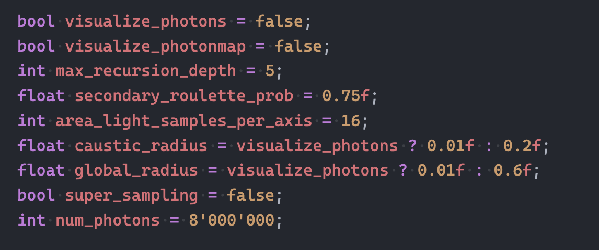

# Rendering Competition
Rendering competition of USI computer graphics, 2025 fall.

## Supported features

- Anti-aliasing (4 $\times$)

- Area lights and soft shadows

- Photon mapping

## Configuration



- visualize_photons: render photons stored in the scene (approximated by a small search radius)
- visualize_photonmap: render the color contribution from the photon map only
- max_recursion_depth: maximum recursion depth for photon tracing and ray tracing
- secondary_roulette_prob: the prob to generate secondary ray for diffuse surfaces in photon tracing
- area_light_samples_per_axis: number of samples per axis for area lights
- caustic_radius: search radius for caustic photon map
- global_radius: search radius for global illumination
- supersampling: if use supersampling
- num_photons: number of photons emitted by each light source

## Complie
```bash
g++ -O3 -o main main.cpp 
```

## Run
```bash
./main result.ppm
```

## Details

### Anti-aliasing

trace 4 rays per pixel with small offsets
```cpp
if (super_sampling) {
    float offset = s / 4.0f;
    for (int m = -1; m <= 1; m += 2) {
        for (int n = -1; n <= 1; n += 2) {
            float ddx = dx + m * offset;
            float ddy = dy + n * offset;
            ...
          }}}
```

### Area lights

```cpp
// In Light.h
// A new class inherited from Light
class AreaLight : public Light {...} 

// let area_light_samples_per_axis = N
// smaple one point for each cell in N x N grid on the area light
// not used currently, the logic is directly in phong model line 334 - 343
void sample_light(...)
```

```cpp
// In Object.h
// A new object Square for visualizing area lights
class Square : public Object {...}
```

```cpp
// In main.cpp, helper func to create light and square simultaneously
void add_area_light()

// also some logic changes in trace_ray()\trace_photon() to exclude the area light object blocking other lights/photons
```

```cpp
// In Material.h
glm::vec3 emissive; // a new property for visualizing area light
```

### Photon mapping

```cpp
// In Photon.h
// sturct for photon and k-d tree node
struct Photon {
  glm::vec3 position;
  glm::vec3 color;
  glm::vec3 direction;
};

struct KDNode {
  Photon photon;
  int left_child = -1; // -1 for no child
  int right_child = -1;
  Axis axis; // split along which axis
};

// a class for building the k-d tree and searching photons
class PhotonMap {
    ...

    ...

    // find_photons within a radius
    // to estimate the light contribution from photons
    void find_photons()
}
```

```cpp
// In main.cpp
// emit photons from light source
void emit_photons() {
    // if point light
    // uniformly in sphere

    // if area light
    // cosine weighted in hemisphere
}

// trace photons and store them in photon map
void trace_photon() {
    if max_depth reached {
        return;
    }
    // return if max depth reached

    // Ruassian roulette
    // determine reflection || refraction (only for refrative object) / diffuse

    if (reflection) {
        // along reflected direction
        trace_photon() // always trace further
    } else {
        if refraction
            // along refracted direction
            trace_photon() // always trace further

        if diffuse {
            // store photon in photon map if not direct light

            // trace new photon
            if roulette < secondary_roulette_prob {
                // only consider diffuse reflection
                // sample new direction in hemisphere defined by hit normal
                // Correction: The answer given during the presentation was incorrect.
                trace_photon()
            }>
        }
    } 
}
```

```cpp
// In Sample.h
// helper functions for sampling directions
```

